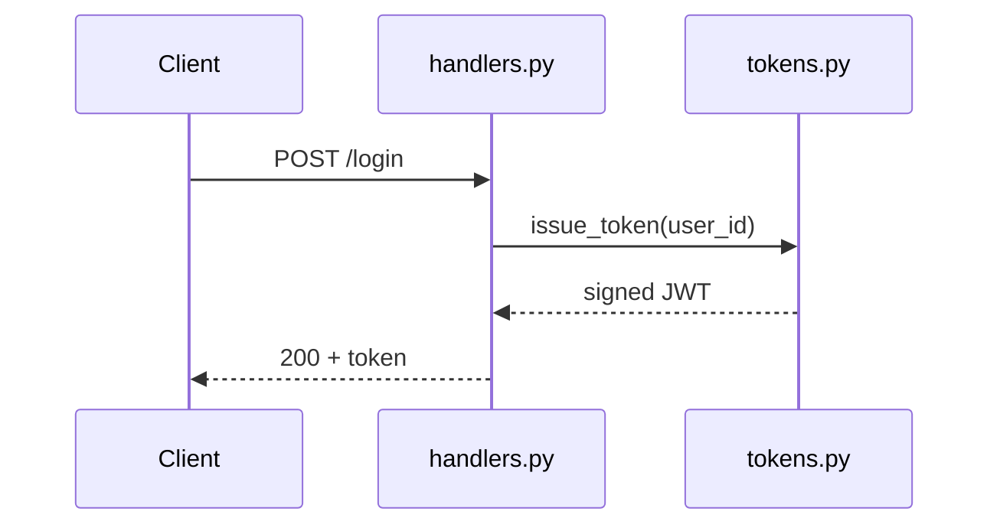

# Architecture Template

**When to use this template**: documenting the internal structure of a component, module, or package — how the files fit together, internal types, extension points, and boundaries. Typical triggers: "explain how this module works internally," "document the architecture of X."

Follow the parent skill's rules: pull signatures and file structures verbatim from the codebase (§1); pair explanations with real snippets (§4); use sequence/flowchart diagrams where multiple components interact (§6).

---

## Template

# [Component/File/Module Name] — Architecture

## Overview
One paragraph: what this component is responsible for, where it sits in the larger system, and what problem its internal structure solves. Name the exact file(s)/directory this document covers so scope is unambiguous.

## File / Directory Layout
The actual on-disk structure (from a real directory listing, not invented), with a one-line purpose per entry — this is the fastest orientation a new reader gets, so it should be exact:

```text
auth/
├── __init__.py
├── handlers.py       # HTTP-facing request handlers
├── tokens.py         # JWT issuance & validation
├── middleware.py      # request auth enforcement
└── tests/
```

## Responsibilities & Boundaries
For each major file/class in scope: what it owns, and — just as important — what it explicitly does *not* do. A boundary is only worth stating once you've verified it against the code, not assumed from the name. Pair each claim with the relevant snippet:

```python
# tokens.py
def issue_token(user_id: str, ttl: int = 3600) -> str:
    ...
```
`issue_token` mints tokens only; it does not persist sessions — that's owned by `sessions.py`.

## Data Flow
Include a diagram only if the flow spans more than one file or service. Pick the diagram type per skill §6 — a request/response flow across files is usually a `sequenceDiagram`, not a `flowchart`:


*Caption: request path from login to token issuance.*

## Key Types & Interfaces
The internal contracts other files depend on — pulled verbatim, not paraphrased, since a paraphrased type signature is exactly the kind of claim that silently goes stale:

```python
class TokenPayload(TypedDict):
    sub: str
    exp: int
    scope: list[str]
```

## Dependencies
- **Internal** — other modules this one imports, and why, one line each.
- **External** — third-party packages, with version constraints noted where they matter (e.g. pinned for a specific fix or breaking change).

## Extension Points
Where and how this is meant to be extended — a registration hook, a plugin interface, a subclass point — and, if it's a common mistake, where it is *not* meant to be extended.

## Edge Cases & Invariants
Non-obvious constraints a change here could silently break: concurrency assumptions, ordering guarantees, anything enforced by convention rather than the type system. This section is usually the most valuable one in the document — don't leave it as an afterthought.

## See Also
Links to the ADR that motivated this structure (if one exists), the API reference for its public surface, and architecture docs for neighboring components it talks to.