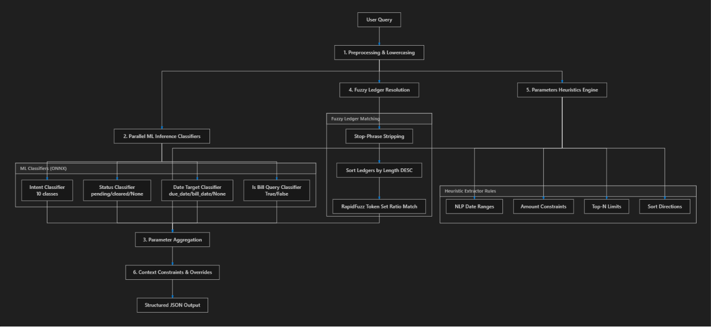

# 📊 TallyPrime Local NLP Bridge: Query Financial Data Offline! 🤖

**Query your local TallyPrime instances offline using natural language queries!**


[](https://opensource.org/licenses/MIT)

**[IMPORTANT NOTE: This bridge runs completely locally and offline on your machine. No financial data is sent to external servers, guaranteeing complete privacy and compliance.]**

This project bridges the gap between natural language processing and local TallyPrime HTTP servers. By utilizing a local MCP (Model Context Protocol) server coupled with an intelligent analytics parser, users can query ledger balances, trial balances, stock summaries, pending bills, and ageing reports using plain English.

---

## ✨ Project Overview

The **TallyPrime Local NLP Bridge** provides a seamless interface to query financial data from a running instance of TallyPrime. It translates unstructured text queries (e.g., "what is the balance of Aarkay Enterprises?") into structured TDL (Tally Definition Language) XML envelopes, posts them to local Tally ports, and renders the response as clean Markdown tables.

**Key Features:**

*   **Dynamic Port Routing:** Automatically probes ports `9000` and `9001` concurrently to detect loaded companies.
*   **Natural Language Parser:** Resolves queries into specific financial intents (Ledgers, Day Book, Stock Summary, Ageing, Trial Balance).
*   **Fuzzy Entity Resolution:** Uses `rapidfuzz` to map spoken or written names to exact ledger accounts and company names.
*   **Advanced Ageing Analytics:** Built-in engine to bucket outstanding bills (`0-30`, `31-60`, `61-90+` days) and trace net receivables/payables.
*   **Contextual Memory:** Tracks reference dates, custom period ranges, and target dates (bill date vs due date).

---

## 🛠️ Technologies Used

*   **Python:** Core programming language.
*   **FastMCP:** Framework for exposing tools via Model Context Protocol.
*   **RapidFuzz:** High-performance fuzzy string matching for company/ledger name alignment.
*   **Requests:** For communication with Tally's XML-based HTTP interface.
*   **ElementTree (XML):** Sanitizes and parses Tally definition formats.

---

## 📊 Key Visuals



*Caption: Core system architecture mapping user queries to TallyPrime instances.*

---

## 🚀 How to Run & Use

### Prerequisites
*   TallyPrime must be running on your system.
*   Enable the TallyPrime HTTP server:
    *   Go to **F1: Help > Settings > Connectivity**.
    *   Set **Client/Server Configuration** to *Both* or *Server* and choose port `9000` or `9001`.

### Setup
1.  Install dependencies:
    ```bash
    pip install requests rapidfuzz mcp fastmcp
    ```

2.  Run the interactive manual testing CLI:
    ```bash
    python cli_query.py
    ```

3.  Host the Model Context Protocol (MCP) server:
    ```bash
    mcp dev mcp_server.py
    ```

---

## 🎯 Potential Improvements

*   **ONNX Classifier:** Integrate a pre-trained ONNX transformer model to classify complex queries instead of heuristics.
*   **Multi-Period Ageing:** Support dynamic interval buckets in ageing reports.
*   **Export Options:** Enable exporting reports to PDF or Excel sheets directly.
*   **Advanced NLU:** Add support for compound queries (e.g., "show stock of item A and ledger balance of B").

---

## 🤝 Contributions

Contributions to this project are welcome! Feel free to open an issue or submit a pull request if you have ideas for new features or improvements.

1.  Fork the repository.
2.  Create a new branch for your feature or bug fix.
3.  Commit your changes.
4.  Push to the branch.
5.  Submit a pull request.

---

## 📜 License

This project is licensed under the MIT License - see the [LICENSE](LICENSE) file for details.

---

## 📧 Contact

### E-mail: [avijain2017@gmail.com](mailto:)
### LinkedIn: [Aviral Jain](https://www.linkedin.com/in/aviral-jain-27018331b)
