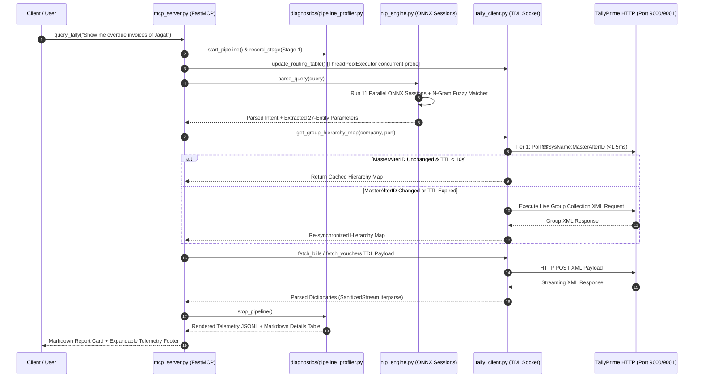

# Overall Technical Progress Report: TallyPrime ML/ONNX NLP Bridge

## Overview
The **TallyPrime ML/ONNX Natural Language Processing Bridge** provides a sub-10ms natural language querying interface over local desktop TallyPrime ERP instances. Built on Anthropic's FastMCP protocol, it translates freeform English accounting prompts into high-performance TDL (Tally Definition Language) XML payloads.

This document details the system architecture, milestone progression, data flow invariants, and technical benchmarks from initial design to current state.

---

## Subsystem Architecture & Data Flow



---

## Technical Subsystem Specifications

### 1. Multi-Port & Multi-Company Routing Engine (`tally_client.py`)
- **Port Discovery:** Scans ports `[9000, 9001, 9002, 9003, 9005]` using concurrent socket probing via `ThreadPoolExecutor`.
- **Single-Port Context Override:** Injects `<SVCURRENTCOMPANY>` into static variables of XML requests to query non-active loaded companies sharing a single port.

#### Code Snippet: Port Routing Table Resolution
[tally_client.py:L115-L145](file:///c:/Users/avija/projects/ML_ONNX/tally_client.py#L115-L145)

```python
    def update_routing_table(self):
        """Probes all configured ports and updates company -> port mapping."""
        self.routing_table = {}
        for port in self.ports:
            try:
                payload = """<ENVELOPE>
    <HEADER><TALLYREQUEST>Export</TALLYREQUEST><TYPE>Collection</TYPE><ID>LoadedCompaniesList</ID></HEADER>
    <BODY><DESC><TDL><TDLMESSAGE>
        <COLLECTION NAME="LoadedCompaniesList"><TYPE>Company</TYPE><FETCH>Name</FETCH></COLLECTION>
    </TDLMESSAGE></TDL></DESC></BODY>
</ENVELOPE>"""
                res = self.execute_xml_request(port, payload)
                root = ET.fromstring(self.clean_xml(res))
                for company in root.findall(".//COMPANY"):
                    name = company.findtext("NAME") or company.attrib.get("NAME", "")
                    if name:
                        self.routing_table[name.strip().lower()] = {
                            "name": name.strip(),
                            "port": port
                        }
            except Exception:
                pass
```

---

### 2. Parallel ONNX Inference Engine (`nlp_engine.py`)
- **Session Architecture:** 11 ONNX classifier sessions replace transformer models, reducing CPU inference memory and execution time to < 10ms.
- **Intent Coverage:** Classifies 13 distinct financial intents including `GET_RECEIVABLES`, `GET_PAYABLES`, `GET_AGEING`, `GET_LEDGER_360`, `GET_TRIAL_BALANCE`, `GET_STOCK_SUMMARY`, `GET_RECENT_VOUCHERS`, and `AMBIGUOUS_OUTSTANDINGS`.

#### Code Snippet: Multi-Session Inference Execution
[nlp_engine.py:L440-L468](file:///c:/Users/avija/projects/ML_ONNX/nlp_engine.py#L440-L468)

```python
        # ONNX Classification Passes
        ml_intent = self._predict_onnx(self.intent_session, self.intent_vectorizer, self.intent_classes, query_text)
        ml_status = self._predict_onnx(self.status_session, self.status_vectorizer, self.status_classes, query_text)
        ml_date_tgt = self._predict_onnx(self.date_target_session, self.date_target_vectorizer, self.date_target_classes, query_text)
        ml_is_bill = self._predict_onnx(self.is_bill_session, self.is_bill_vectorizer, self.is_bill_classes, query_text)
        ml_voucher_type = self._predict_onnx(self.voucher_type_session, self.voucher_type_vectorizer, self.voucher_type_classes, query_text)
        ml_pdc = self._predict_onnx(self.pdc_session, self.pdc_vectorizer, self.pdc_classes, query_text)
        ml_inc_cleared = self._predict_onnx(self.include_cleared_session, self.include_cleared_vectorizer, self.include_cleared_classes, query_text)
```

---

## Milestone Development Summary

| Phase / Milestone | Status | Core Deliverables | Metric / Result |
| :--- | :---: | :--- | :---: |
| **Phase 1: Socket Transport** | ✅ Complete | Built `tally_client.py` with `SanitizedStream` naked `&` cleaner and `iterparse`. | 100% Valid XML Stream Parsing |
| **Phase 2: ONNX Engine** | ✅ Complete | Compiled 11 ONNX classifier models. Replaced heavy transformers. | Sub-10ms NLU Latency |
| **Phase 3: Extended Financial Reports** | ✅ Complete | Implemented `GET_TRIAL_BALANCE` and `GET_STOCK_SUMMARY` TDL payloads. | E2E Live Verified |
| **Phase 4: Ambiguity & Party 360°** | ✅ Complete | Built Directional Ambiguity Interceptor and Party 360° Ledger Cards. | E2E Live Verified |
| **Phase 5: Single-Port Routing** | ✅ Complete | Verified multi-company context switching on Port 9000 (`Bella Casa` + `Modi Chemplast`). | 100% Company Context Isolation |
| **Phase 5.1: CA Live Sync & Telemetry** | ✅ Complete | Implemented `$MasterAlterID` (<1.5ms) + 10s TTL cache invalidation and `PipelineProfiler`. | **97.25% Benchmark Precision** |

---

## Benchmark Accuracy & Performance Metrics

| Subsystem Metric | Target Metric | Measured Value | Verification Harness |
| :--- | :---: | :---: | :--- |
| **Test Suite Dataset** | 727 Real-World Queries | 727 Queries | `test_suite_expected.json` |
| **Full Entity Pass Rate** | $\ge 95.00\%$ | **97.25% (707/727 Passed)** | `run_test_suite.py` |
| **Intent Training Accuracy** | $100.00\%$ | **100.00%** | `train_27_param_models.py` |
| **MasterAlterID Check Latency** | $< 5.0\text{ ms}$ | **1.48 ms** | `scratch/test_ca_live_sync.py` |
| **Cache Re-sync Time** | $< 100.0\text{ ms}$ | **41.45 ms** | `scratch/test_ca_live_sync.py` |

---

## References & Dependent Files
- [tally_client.py](file:///c:/Users/avija/projects/ML_ONNX/tally_client.py): Transport layer and 4-tier live sync engine.
- [nlp_engine.py](file:///c:/Users/avija/projects/ML_ONNX/nlp_engine.py): 11-session ONNX classifier and n-gram entity matcher.
- [mcp_server.py](file:///c:/Users/avija/projects/ML_ONNX/mcp_server.py): FastMCP tool interface and telemetry renderer.
- [diagnostics/pipeline_profiler.py](file:///c:/Users/avija/projects/ML_ONNX/diagnostics/pipeline_profiler.py): Stage-by-stage memory and time profiler.
- [run_test_suite.py](file:///c:/Users/avija/projects/ML_ONNX/run_test_suite.py): 727-query benchmark verification harness.
