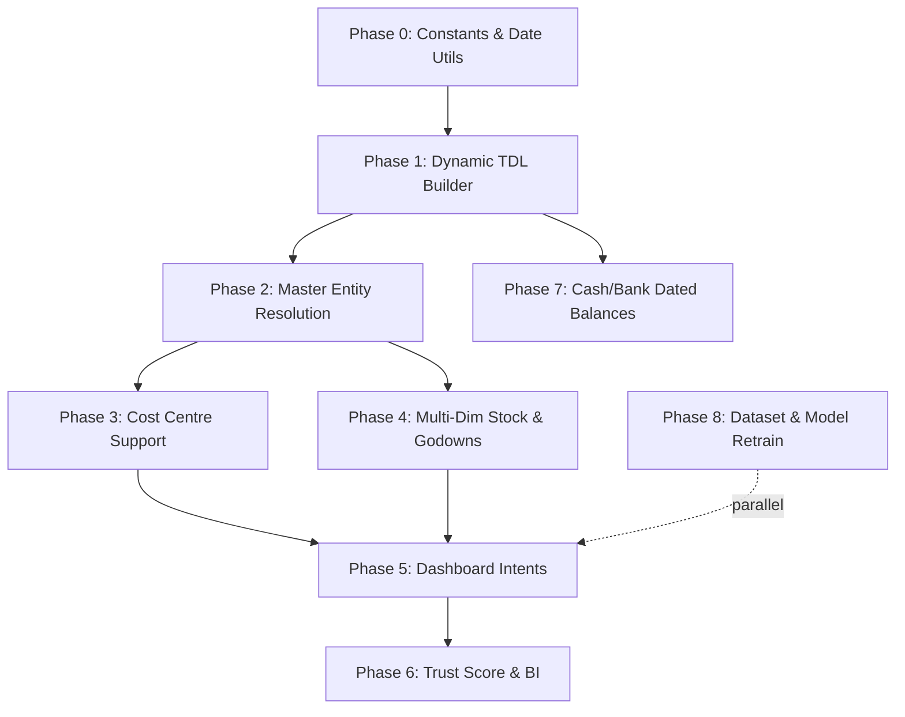

# ML_ONNX Pipeline: Final Chronological Implementation Plan

> **Baseline Architecture**: 964-line `mcp_server.py` | 1298-line `nlp_engine.py` | 1607-line `tally_client.py` | 226-line `analytics_engine.py` | 141-line `cli_query.py` | 13 batch files (1,209 queries in `scratch/batches/`) | 11 ONNX models.

This plan integrates all architectural decisions, benchmarks, and data schemas finalized in [comment_responses.md](file:///c:/Users/avija/.gemini/antigravity/brain/7ef30f6c-6b89-49d2-8c4c-11b1a9e8a32f/comment_responses.md). Every phase is structured with exact file changes, underlying logic, and live verification criteria.

---

## Architectural Decisions & Baseline Alignment

1. **TDL Reference Compliance**: All XML generation in Phase 1 and beyond must strictly consult the TDL Reference Skill at [`.agents/skills/tdl_reference/SKILL.md`](file:///c:/Users/avija/projects/ML_ONNX/.agents/skills/tdl_reference/SKILL.md) and knowledge graph (`graph.json`). Never guess TDL tags or syntax.
2. **ONNX Model Deprecations**:
   - `group_name_model.onnx` (only 4 labels) and `godown_name_model.onnx` (only 2 labels) are **deprecated**. Replaced by live fuzzy matching against runtime Tally caches.
3. **Inventory Master Disambiguation**: Collection-type-aware fuzzy matching across 3 cached master lists (Stock Items, Stock Groups, Stock Categories) with sub-millisecond execution (< 0.7ms) and `$S()`, `$SG()`, `$SC()` explicit overrides.
4. **Verified Trust Score**: Mathematically bounded credit-risk formula $[0, 100\%]$ incorporating settlement discipline (40%), transaction frequency (25%), relationship recency (20%), log-scaled volume (15%), and overdue default penalties.
5. **Single Ground-Truth Dataset**: `scratch/batches/` (1,209 queries) is the consolidated superset (incorporating the 730 baseline queries + 482 real-world suite). No external dataset merging.

---

## Phase 0: Foundation — Constants, Type Safety & Shared Date Utilities
**Priority**: 🔴 Critical (Foundation for all subsequent phases)  
**Estimated Scope**: ~220 lines across 3 files

### Rationale
Scattered hardcoded group strings (`"Sundry Debtors"` across 9 lines in 3 files), magic dates (`"19000101"`, `"20991231"`), and 3 duplicated date parsers cause silent logic failures. Centralizing them into typed constants prevents regressions and enables clean import-time validation.

---

### 0.1 — Create `constants.py`

#### [NEW] [constants.py](file:///c:/Users/avija/projects/ML_ONNX/constants.py)

```python
# --- Tally Standard Group Hierarchies ---
GROUP_SUNDRY_DEBTORS = "Sundry Debtors"
GROUP_SUNDRY_CREDITORS = "Sundry Creditors"
GROUP_TRADE_RECEIVABLES = "Trade Receivables"
GROUP_TRADE_PAYABLES = "Trade Payables"
GROUP_BANK_ACCOUNTS = "Bank Accounts"
GROUP_CASH_IN_HAND = "Cash-in-Hand"
GROUP_BANK_OD = "Bank OD A/c"

RECEIVABLE_GROUPS = {GROUP_SUNDRY_DEBTORS, GROUP_TRADE_RECEIVABLES}
PAYABLE_GROUPS = {GROUP_SUNDRY_CREDITORS, GROUP_TRADE_PAYABLES}
CASH_BANK_GROUPS = {GROUP_BANK_ACCOUNTS, GROUP_CASH_IN_HAND, GROUP_BANK_OD}

# --- Standard Queryable Root Groups for Group Summary ---
QUERYABLE_ROOT_GROUPS = (
    RECEIVABLE_GROUPS | PAYABLE_GROUPS | CASH_BANK_GROUPS | {
        "Direct Expenses", "Indirect Expenses", "Direct Incomes", 
        "Indirect Incomes", "Fixed Assets", "Investments",
        "Loans & Advances (Asset)", "Current Assets", "Current Liabilities",
        "Secured Loans", "Unsecured Loans", "Capital Account", "Duties & Taxes"
    }
)

# --- TDL Date Boundaries ---
DATE_EPOCH = "19000101"       # Tally historical lower bound
DATE_FAR_FUTURE = "20991231"  # Tally upper bound

# --- Timeouts & Limits ---
DEFAULT_HTTP_TIMEOUT = 12.0
FAST_PROBE_TIMEOUT = 0.6
DEFAULT_STREAM_TIMEOUT = 30.0
CHUNK_SOCKET_TIMEOUT = 8.0

DEFAULT_DISPLAY_LIMIT = 25
MAX_FETCH_LIMIT = 200
VOUCHER_DISPLAY_LIMIT = 20
DEFAULT_AGEING_INTERVALS = [30, 60, 90]

# --- Voucher Type TDL Macros ---
VOUCHER_TYPE_MACROS = {
    "sales":        "$$VchTypeSales",
    "purchase":     "$$VchTypePurchase",
    "receipt":      "$$VchTypeReceipt",
    "payment":      "$$VchTypePayment",
    "journal":      "$$VchTypeJournal",
    "contra":       "$$VchTypeContra",
    "credit_note":  "$$VchTypeCreditNote",
    "debit_note":   "$$VchTypeDebitNote",
}

# --- TDL Static Variable System Formats ---
TDL_EXPORT_FORMAT = "$$SysName:XML"
```

---

### 0.2 — Create `date_utils.py`

#### [NEW] [date_utils.py](file:///c:/Users/avija/projects/ML_ONNX/date_utils.py)

Consolidate the duplicated date logic from `analytics_engine._parse_date`, `nlp_engine` regex, and `mcp_server.resolve_date_range`:

```python
from datetime import datetime, timedelta
import re

def parse_date(date_str: str) -> datetime | None:
    """Canonical multi-format date parser (%Y%m%d, %d-%b-%Y, %d-%b-%y, %Y-%m-%d, %d/%m/%Y)."""

def to_tally_date(dt: datetime) -> str:
    """Convert datetime object to YYYYMMDD string for TDL XML."""

def resolve_date_range(params: dict, context: dict) -> tuple[str, str]:
    """Single source of truth for converting date_filter and reference_date into (from_date, to_date)."""

def compute_fiscal_year(reference_date: datetime) -> tuple[datetime, datetime]:
    """Compute Indian fiscal year start (01-Apr) and end (31-Mar) bounds."""
```

---

### 0.3 — Wire Constants into Existing Modules

#### [MODIFY] [tally_client.py](file:///c:/Users/avija/projects/ML_ONNX/tally_client.py)
- Replace all raw string literals `"Sundry Debtors"`, `"Sundry Creditors"`, `"19000101"`, `"20991231"` with imports from `constants.py`.
- Wire `date_utils.py` for date formatting.

#### [MODIFY] [mcp_server.py](file:///c:/Users/avija/projects/ML_ONNX/mcp_server.py)
- Import `constants.py` and replace hardcoded limits (`25`, `200`, `20`, `[30, 60, 90]`).
- Delegate `resolve_date_range` to `date_utils.py`.

#### [MODIFY] [nlp_engine.py](file:///c:/Users/avija/projects/ML_ONNX/nlp_engine.py)
- Remove hardcoded `"Reliance Job"` and `"Bhiwandi Godown"` values.
- Replace group literals with constants.

### Phase 0 Verification
```bash
# Verify no dangling hardcoded group strings
python -c "import tally_client, mcp_server, nlp_engine, constants, date_utils; print('Phase 0 Imports OK')"
python cli_query.py
# Query: "balance of $L(khusbuddin) in $C(modi chem) 26-10-2025" -> Exact matching baseline
```

---

## Phase 1: Dynamic TDL Envelope Builder (`tdl_builder.py`)
**Priority**: 🔴 Critical (Powers all dynamic XML requests)  
**Estimated Scope**: ~420 lines in new file, ~180 lines refactored in `tally_client.py`

### Rationale
Replace all 15 hand-coded f-string XML templates in `tally_client.py` with a structured, data-driven builder. All XML schemas must conform strictly to [`.agents/skills/tdl_reference/SKILL.md`](file:///c:/Users/avija/projects/ML_ONNX/.agents/skills/tdl_reference/SKILL.md).

---

### 1.1 — Create `tdl_builder.py`

#### [NEW] [tdl_builder.py](file:///c:/Users/avija/projects/ML_ONNX/tdl_builder.py)

```python
import html
from typing import List, Dict, Optional
import constants

class TDLEnvelopeBuilder:
    """
    Data-driven TDL XML Envelope Generator.
    Adheres strictly to Tally XML socket protocol & TDL Knowledge Graph specs.
    """
    def __init__(self):
        self._request_type: str = "Collection"  # "Collection" or "Data"
        self._report_id: Optional[str] = None   # "Group Summary", "Trial Balance", "Godown Summary", etc.
        self._company: Optional[str] = None
        self._collection_name: str = "DynamicCollection"
        self._collection_type: Optional[str] = None
        self._fetch_fields: List[str] = []
        self._filters: Dict[str, str] = {}     # {FilterName: TDL Formula}
        self._computes: Dict[str, str] = {}    # {ComputeName: Expression}
        self._child_of: Optional[str] = None
        self._belongs_to: bool = False
        self._static_vars: Dict[str, str] = {
            "SVEXPORTFORMAT": constants.TDL_EXPORT_FORMAT
        }
        self._is_initialise: bool = True       # Enforces ISINITIALISE="Yes" for memory pop

    def set_request_type(self, req_type: str) -> 'TDLEnvelopeBuilder': ...
    def set_report_id(self, report_id: str) -> 'TDLEnvelopeBuilder': ...
    def set_company(self, company: str) -> 'TDLEnvelopeBuilder': ...
    def set_collection(self, coll_type: str, name: str = "DynamicColl") -> 'TDLEnvelopeBuilder': ...
    def set_fetch(self, fields: List[str]) -> 'TDLEnvelopeBuilder': ...
    def set_date_range(self, from_date: str, to_date: str) -> 'TDLEnvelopeBuilder': ...
    def set_current_date(self, current_date: str) -> 'TDLEnvelopeBuilder': ...
    def add_filter(self, name: str, formula: str) -> 'TDLEnvelopeBuilder': ...
    def add_compute(self, name: str, expr: str) -> 'TDLEnvelopeBuilder': ...
    def set_child_of(self, parent: str, belongs_to: bool = False) -> 'TDLEnvelopeBuilder': ...
    def set_static_var(self, key: str, value: str) -> 'TDLEnvelopeBuilder': ...
    
    # Static variable helpers for native reports:
    def set_group_name(self, group: str) -> 'TDLEnvelopeBuilder': ...
    def set_godown_name(self, godown: str) -> 'TDLEnvelopeBuilder': ...
    def set_cost_centre_name(self, cc: str) -> 'TDLEnvelopeBuilder': ...
    def set_stock_group_name(self, sg: str) -> 'TDLEnvelopeBuilder': ...
    def set_explode_flag(self, explode: bool = True) -> 'TDLEnvelopeBuilder': ...
    def set_itemwise(self, itemwise: bool = True) -> 'TDLEnvelopeBuilder': ...

    def build(self) -> str:
        """
        Generates clean, XML-escaped payload.
        Ensures ISINITIALISE="Yes" is always present on Collection declarations.
        """

    @classmethod
    def from_params(cls, params: dict, company: str, intent: str) -> 'TDLEnvelopeBuilder':
        """
        Factory translating the 28-parameter NLP envelope into dynamic TDL parameters.
        """
```

### 1.2 — Refactor `tally_client.py` to Use `TDLEnvelopeBuilder`

#### [MODIFY] [tally_client.py](file:///c:/Users/avija/projects/ML_ONNX/tally_client.py)
Sequentially replace the 15 static string templates with builder invocations:
1. `fetch_ledgers` (Ledgers & Groups collections)
2. `fetch_stock_summary` (StockItem collection)
3. `fetch_trial_balance` (Trial Balance native report)
4. `fetch_party_outstandings` (Group Summary report & Ledger collections)
5. `fetch_bills` (Bill collection with dynamic `$BillDate`, `$Parent`, and `$ClosingBalance` formulae)
6. `fetch_recent_vouchers` (Vouchers:VoucherType collection with projected fields)
7. `fetch_ledger_dated_balance` (Multi-stage resolution using builder)

### Phase 1 Verification
```bash
python cli_query.py
# Execute regression test suite across Bella Casa and Modi Chem:
# - "receivables in $C(bella casa) 15-aug-2017"
# - "stock summary in $C(modi chem)"
# - "trial balance of $C(bella casa)"
# Output must match exact pre-refactor XML schemas and numbers.
```

---

## Phase 2: Dynamic Entity Resolution Engine (Deprecate Static Models)
**Priority**: 🟠 High  
**Estimated Scope**: ~160 lines in `nlp_engine.py` & `tally_client.py`

### Rationale
`group_name_model.onnx` (4 labels) and `godown_name_model.onnx` (2 labels) are static and incapable of generalizing across arbitrary Tally companies. We deprecate both models and implement dynamic, C++ SIMD-accelerated fuzzy resolution against live company master caches (< 0.7ms latency).

---

### 2.1 — Master Fetchers & Caches in `tally_client.py`

#### [MODIFY] [tally_client.py](file:///c:/Users/avija/projects/ML_ONNX/tally_client.py)

Add master fetchers utilizing `TDLEnvelopeBuilder`:
```python
def fetch_godowns(self, company_name: str, port: int) -> list[dict]:
    """Fetch Godown masters: [{name, parent}]."""

def fetch_cost_centres(self, company_name: str, port: int) -> list[dict]:
    """Fetch Cost Centre masters: [{name, parent, category}]."""

def fetch_stock_groups_and_categories(self, company_name: str, port: int) -> tuple[list[str], list[str]]:
    """Fetch StockGroup and StockCategory master name lists."""
```

### 2.2 — Dynamic Resolution in `nlp_engine.py`

#### [MODIFY] [nlp_engine.py](file:///c:/Users/avija/projects/ML_ONNX/nlp_engine.py)

1. **Deprecate Model Calls**: Remove invocations to `group_name_session` and `godown_name_session`.
2. **Implement Multi-Entity Master Matcher**:
```python
def resolve_entity_from_masters(self, token: str, candidate_list: list[str], threshold: int = 75) -> str | None:
    """Uses RapidFuzz token_set_ratio with score_cutoff=threshold for sub-millisecond matching."""
```
3. **Collection-Type-Aware Stock Resolution**:
   - Extract candidate tokens via regex or `$S()`, `$SG()`, `$SC()`.
   - Score against Stock Items, Stock Groups, and Stock Categories independently.
   - Assign to `params["item_name"]`, `params["stock_group"]`, or `params["stock_category"]` based on top score with explicit tag precedence.

### Phase 2 Verification
```bash
python cli_query.py
# Test queries:
# - "stock in $C(modi chem) for raw materials" -> populates stock_group
# - "stock of Copper Wire in $C(modi chem)" -> populates item_name
# - "expenses under Duties & Taxes in $C(bella casa)" -> resolves dynamic group
```

---

## Phase 3: Cost Centre & Cost Category Deep Integration
**Priority**: 🟠 High  
**Estimated Scope**: ~220 lines across `tally_client.py`, `mcp_server.py`, `tdl_builder.py`

### Rationale
Enables departmental and profit-center queries by integrating native TDL `Cost Centre Breakup` reporting and voucher-level `CostCentreAllocations` filtering.

---

### 3.1 — Native Cost Centre Breakdown in `tally_client.py`

#### [MODIFY] [tally_client.py](file:///c:/Users/avija/projects/ML_ONNX/tally_client.py)

```python
def fetch_cost_centre_breakup(
    self, company_name: str, port: int,
    cost_centre: str = None,
    from_date: str = None, to_date: str = None
) -> list[dict]:
    """
    Queries 'Cost Centre Breakup' report when a centre is specified,
    or queries 'Cost Centre' collection for all-centre summary.
    """
```

### 3.2 — Cost Centre Filtering on Transactions

#### [MODIFY] [tdl_builder.py](file:///c:/Users/avija/projects/ML_ONNX/tdl_builder.py)
- Inject `<COSTCENTRENAME>{name}</COSTCENTRENAME>` into `<STATICVARIABLES>` for native reports.
- Inject `$$HasCostCentre:"{name}"` or walk `CostCentreAllocations.List` for voucher-level filters.

### 3.3 — Intent Handling in `mcp_server.py`

#### [MODIFY] [mcp_server.py](file:///c:/Users/avija/projects/ML_ONNX/mcp_server.py)
Format cost center balances into clean Markdown tables with columns: `Cost Centre | Category | Debit (₹) | Credit (₹) | Net Balance (₹)`.

---

## Phase 4: Stock Item, Stock Category, Batch & Godown Multi-Dimensional Queries
**Priority**: 🟠 High  
**Estimated Scope**: ~300 lines in `tally_client.py` and `mcp_server.py`

### Rationale
Expands `GET_STOCK_SUMMARY` from basic closing balance into full inventory analytics (batch expiry, negative stock detection, godown breakdown).

---

### 4.1 — Multi-Dimensional Stock Summary in `tally_client.py`

#### [MODIFY] [tally_client.py](file:///c:/Users/avija/projects/ML_ONNX/tally_client.py)

```python
def fetch_stock_summary(
    self, company_name: str, port: int,
    stock_group: str = None,
    stock_category: str = None,
    godown_name: str = None,
    item_name: str = None,
    as_of_date: str = None
) -> list[dict]:
    """
    Multi-dimensional inventory fetch:
    - If godown_name: routes to native 'Godown Summary' report.
    - If item/group/category: builds StockItem collection with CHILDOF / category filter.
    - Supports point-in-time inventory valuation via SVTODATE.
    """
```

### 4.2 — Batch-Wise Tracking Details

#### [MODIFY] [tally_client.py](file:///c:/Users/avija/projects/ML_ONNX/tally_client.py)

```python
def fetch_batch_details(
    self, company_name: str, port: int,
    stock_item: str = None, godown_name: str = None
) -> list[dict]:
    """Extracts batch allocation tables, manufacturing dates, and expiry dates."""
```

### Phase 4 Verification
```bash
python cli_query.py
# - "stock in Bhiwandi Godown in $C(modi chem)" -> Godown Summary table
# - "stock of PVC Resin as of 31-mar-2025 in $C(modi chem)" -> Dated stock valuation
```

---

## Phase 5: Dashboard-Style Intents (`GET_COMPANY_SUMMARY` & `GET_LEDGER_BALANCE`)
**Priority**: 🟡 Medium-High  
**Estimated Scope**: ~280 lines in `mcp_server.py`, `tally_client.py`, `nlp_engine.py`

### Rationale
1. **Merge `GET_LEDGER_360` into `GET_LEDGER_BALANCE`**: Single-ledger queries render a comprehensive 4-card dashboard (Balance + Bills + Monthly Trend + Recent Txns). Remove all hardcoded mock rows.
2. **Rename `GET_COMPARATIVE_SUMMARY` → `GET_COMPANY_SUMMARY`**: Transform company summaries into executive financial dashboards.

---

### 5.1 — 4-Card Single Ledger Dashboard

#### [MODIFY] [mcp_server.py](file:///c:/Users/avija/projects/ML_ONNX/mcp_server.py)

Upgrade `GET_LEDGER_BALANCE` handler:
- **Card 1 (Balance & Movement)**: Opening Balance, Dated Closing Balance, Net Period Movement.
- **Card 2 (Pending Bills & Aging)**: Filtered outstanding bills table with overdue alerts.
- **Card 3 (Monthly Trend)**: 6–12 month debit/credit trajectory (via `fetch_ledger_monthly_summary`).
- **Card 4 (Recent Activity)**: Last 5 posted vouchers for this party.

#### [MODIFY] [tally_client.py](file:///c:/Users/avija/projects/ML_ONNX/tally_client.py)
Add `fetch_ledger_monthly_summary(company_name, port, ledger_name)` using native `Ledger Monthly Summary` report.

### 5.2 — Executive Company Dashboard (`GET_COMPANY_SUMMARY`)

#### [MODIFY] [mcp_server.py](file:///c:/Users/avija/projects/ML_ONNX/mcp_server.py)
- **Receivables & Payables Snapshot**: Net position with total Dr/Cr.
- **Cash & Bank Liquidity**: Immediate available liquidity across cash and bank accounts.
- **Top 5 Exposure Lists**: Top 5 Debtors & Top 5 Creditors with overdue badges.
- **Inventory Valuation**: Top stock groups with total quantities and value.

#### [MODIFY] [nlp_engine.py](file:///c:/Users/avija/projects/ML_ONNX/nlp_engine.py)
Update intent mappings from `GET_COMPARATIVE_SUMMARY` to `GET_COMPANY_SUMMARY`. Delete standalone `GET_LEDGER_360` branch.

### Phase 5 Verification
```bash
python cli_query.py
# - "balance of $L(khusbuddin) in $C(modi chem) 26-10-2025" -> Renders full 4-card dashboard
# - "company overview of $C(bella casa) for FY 17-18" -> Renders Executive Company Dashboard
```

---

## Phase 6: Business Intelligence — Trust Score & Transaction Analytics
**Priority**: 🟡 Medium  
**Estimated Scope**: ~190 lines in `analytics_engine.py`, `tally_client.py`, `mcp_server.py`

### Rationale
Implements the 100% verified, bounded mathematical trust score formula to power queries like *"who are my most trusted clients"* and *"top vendors by transaction count"*.

---

### 6.1 — Verified Trust Score Implementation

#### [MODIFY] [analytics_engine.py](file:///c:/Users/avija/projects/ML_ONNX/analytics_engine.py)

```python
import math
from datetime import datetime

def compute_trust_scores(
    self, 
    party_vouchers: list[dict],
    party_bills: list[dict],
    party_outstandings: list[dict],
    reference_date: datetime
) -> list[dict]:
    """
    Computes rigorous bounded Trust Score in [0, 100%]:
    
    T = [ 0.40 * S_settle + 0.25 * S_freq + 0.20 * S_recent + 0.15 * S_volume ] * (1 - P_overdue) * 100%
    """
```

### 6.2 — Party Transaction Aggregations in `tally_client.py`

#### [MODIFY] [tally_client.py](file:///c:/Users/avija/projects/ML_ONNX/tally_client.py)

```python
def fetch_party_voucher_counts(
    self, company_name: str, port: int, group_name: str,
    from_date: str = None, to_date: str = None
) -> list[dict]:
    """Uses TDL Collection with SOURCECOLLECTION + AGGRCOMPUTE to count vouchers per party."""
```

### Phase 6 Verification
```bash
python cli_query.py
# - "who are my most trusted clients in $C(bella casa) for FY 17-18"
# - "top vendors by transaction count in $C(modi chem) for FY 25-26"
```

---

## Phase 7: Historical Dated Balance Edge Cases (Cash & Bank Accounts)
**Priority**: 🟡 Medium  
**Estimated Scope**: ~80 lines in `tally_client.py`

### Rationale
Non-bill-wise accounts (e.g. `Cash-in-Hand`, `Bank Accounts`, `Direct Incomes`) fail when dated balances are queried because they lack bill tracking and belong to non-debtor root groups.

---

### 7.1 — Generic Group Summary Root Walker

#### [MODIFY] [tally_client.py](file:///c:/Users/avija/projects/ML_ONNX/tally_client.py)

In `fetch_ledger_dated_balance()`:
1. Walk the company's cached group hierarchy map upwards from the ledger's parent group.
2. Identify the first matching root group in `constants.QUERYABLE_ROOT_GROUPS`.
3. Query native `Group Summary` with `<GROUPNAME>{root_group}</GROUPNAME>`, `<EXPLODEFLAG>Yes</EXPLODEFLAG>`, `<ISITEMWISE>Yes</ISITEMWISE>`, and `<SVTODATE>{reference_date}</SVTODATE>`.
4. Parse the specific ledger's closing Dr/Cr amount.

### Phase 7 Verification
```bash
python cli_query.py
# - "balance of $L(cash) in $C(modi chem) 26-10-2025" -> Non-zero balance
# - "balance of $L(hdfc bank) in $C(bella casa) 15-aug-2017" -> Accurate bank balance
```

---

## Phase 8: Model Retraining & Dataset Alignment (1,209 Query Suite)
**Priority**: 🟡 Medium  
**Estimated Scope**: ~120 lines in dataset preparation scripts & `nlp_engine.py`

### Rationale
The 1,209 queries across the 13 batch files in `scratch/batches/` already cover all 14 operational intent classes. We map and train the intent model directly on this consolidated ground-truth dataset without external merges or synthetic artifacts.

---

### 8.1 — Consolidated Dataset Preparation

#### [NEW] [prepare_training_dataset.py](file:///c:/Users/avija/projects/ML_ONNX/prepare_training_dataset.py)
1. Read all 13 batch files (`scratch/batches/batch_01.json` to `batch_13.json`).
2. Map ground-truth intent labels:
   - IDs 1–727: Loaded from `test_suite_expected.json`.
   - IDs 728–1209: Labeled according to their batch domain mapping and query syntax.
3. Replace deprecated `GET_COMPARATIVE_SUMMARY` with `GET_COMPANY_SUMMARY`.
4. Map `GET_LEDGER_360` queries to `GET_LEDGER_BALANCE`.
5. Export clean, consolidated `training_data_v2.json`.

### 8.2 — Retrain & Export ONNX Intent Model
```bash
python train_nlp.py --input training_data_v2.json --output models/intent_model.onnx
```

### Phase 8 Verification
- Cross-validation accuracy > 92% across all 14 intent classes.
- Zero unclassified or dead intents.

---

## Execution Matrix & Dependency Graph



### Chronological Execution Roadmap

| Sequence | Phase | Target Modules | Primary Deliverable |
|:---:|:---|:---|:---|
| **Step 1** | **Phase 0** | `constants.py`, `date_utils.py`, `tally_client.py` | Eliminate magic strings & unify date parsers |
| **Step 2** | **Phase 1** | `tdl_builder.py`, `tally_client.py` | Data-driven XML requests from 28-param envelope |
| **Step 3** | **Phase 2** | `nlp_engine.py`, `tally_client.py` | Deprecate static models; live SIMD fuzzy matching |
| **Step 4** | **Phase 7** | `tally_client.py` | Generic group walker for Cash/Bank dated balances |
| **Step 5** | **Phase 3** | `tally_client.py`, `mcp_server.py` | Native Cost Centre Breakup and voucher filters |
| **Step 6** | **Phase 4** | `tally_client.py`, `mcp_server.py` | Godown, Category & Batch inventory analytics |
| **Step 7** | **Phase 5** | `mcp_server.py`, `nlp_engine.py` | 4-Card Ledger Dashboard & Executive Company Dashboard |
| **Step 8** | **Phase 6** | `analytics_engine.py`, `mcp_server.py` | Verified 5-factor Trust Score calculation |
| **Step 9** | **Phase 8** | `prepare_training_dataset.py`, `models/` | Retrain ONNX model on 1,209-query batch dataset |
