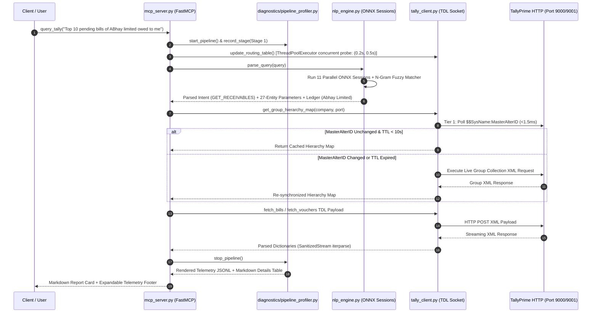

# Overall Technical Progress Report: TallyPrime ML/ONNX NLP Bridge

## Overview
The **TallyPrime ML/ONNX Natural Language Processing Bridge** provides a sub-10ms natural language querying interface over local desktop TallyPrime ERP instances. Built on Anthropic's FastMCP protocol, it translates freeform English accounting prompts into high-performance TDL (Tally Definition Language) XML payloads.

This document details the system architecture, milestone progression, data flow invariants, and technical benchmarks from initial design to current state.

---

## Subsystem Architecture & Data Flow



---

## Technical Subsystem Specifications

### 1. Multi-Port & Fast Concurrent Routing Engine (`tally_client.py`)
- **Port Discovery & Ultra-Short Timeouts:** Probes configured ports `[9000, 9001, 9002, 9003, 9005]` using concurrent socket probing via `ThreadPoolExecutor`.
- **Fast Timeout Optimization:** Uses `timeout=(0.2, 0.5)` (200ms connect, 500ms read) in `probe_port` to eliminate Windows TCP SYN 2.05-second connection hangs when inactive ports are probed.
- **Single-Port Context Override:** Injects `<SVCURRENTCOMPANY>` into static variables of XML requests to query non-active loaded companies sharing a single port.

#### Code Snippet: Port Routing & Fast Probing
[tally_client.py:L175-L200](file:///c:/Users/avija/projects/ML_ONNX/tally_client.py#L175-L200)

```python
    def probe_port(port):
        url = f"http://localhost:{port}"
        try:
            payload = """<ENVELOPE>
    <HEADER><TALLYREQUEST>Export</TALLYREQUEST><TYPE>Collection</TYPE><ID>LoadedCompaniesList</ID></HEADER>
    <BODY><DESC><TDL><TDLMESSAGE>
        <COLLECTION NAME="LoadedCompaniesList"><TYPE>Company</TYPE><FETCH>Name</FETCH></COLLECTION>
    </TDLMESSAGE></TDL></DESC></BODY>
</ENVELOPE>"""
            # Tuple timeout (0.2s connect, 0.5s read) prevents 2.05-second socket SYN retries on closed ports
            res = requests.post(url, data=payload, headers={'Content-Type': 'text/xml'}, timeout=(0.2, 0.5))
            if res.status_code == 200 and "<RESPONSE>" in res.text:
                return port, res.text
        except Exception:
            pass
        return port, None
```

---

### 2. Parallel ONNX Inference & Directional Intent Engine (`nlp_engine.py`)
- **Session Architecture:** 11 ONNX classifier sessions replace transformer models, reducing CPU inference memory and execution time to < 10ms.
- **Directional Intent Resolver:** Overrides `AMBIGUOUS_OUTSTANDINGS` to `GET_RECEIVABLES` or `GET_PAYABLES` when explicit directional clauses (`"owed to me"`, `"owed by customer"`, `"owed to supplier"`, `"owed by me"`) are present, without corrupting `GET_AGEING`, `GET_TRIAL_BALANCE`, or `UNKNOWN` intents.

#### Code Snippet: Directional Post-Processing Override
[nlp_engine.py:L1120-L1138](file:///c:/Users/avija/projects/ML_ONNX/nlp_engine.py#L1120-L1138)

```python
        # Directional override: ONLY for AMBIGUOUS_OUTSTANDINGS intent
        if detected_intent == "AMBIGUOUS_OUTSTANDINGS":
            has_rec_dir = any(k in q_dir_lower for k in [
                "owed to me", "owed to us", "owed by customer", "owed by customers", "owed by debtor", "owed by debtors",
                "receivable", "receivables", "to collect", "pending collection", "pending collections",
                "due from", "to receive", "money owed to", "pending receivable", "pending receivables"
            ])
            has_pay_dir = any(k in q_dir_lower for k in [
                "owed by me", "owed by us", "owed to supplier", "owed to suppliers", "owed to vendor", "owed to vendors",
                "owed to creditor", "owed to creditors", "payable", "payables", "bills to pay",
                "payments to make", "bills i owe", "payments i owe", "pending payable", "pending payables"
            ])
            if has_rec_dir and not has_pay_dir:
                detected_intent = "GET_RECEIVABLES"
            elif has_pay_dir and not has_rec_dir:
                detected_intent = "GET_PAYABLES"
```

---

### 3. Match-Tier Cross-Company Ledger Disambiguation (`nlp_engine.py`)
- **Corporate Stop-Word Filtering:** Includes corporate suffixes (`"limited"`, `"ltd"`, `"pvt"`, `"private"`) in common stop words to prevent standalone 1-token windows from matching every `*LIMITED` account at 100% score.
- **Match-Tier Classification (`match_tier`):** Classifies candidate matches into `tier=1` (Exact Substring Word-Boundary) vs `tier=3` (Fuzzy N-Gram Token Set).
- **Quality-Tier Cross-Company Ranking:** Ensures an exact match in Company A (`match_tier=1`) strictly takes precedence over a fuzzy partial match in Company B (`match_tier=3`).

#### Code Snippet: Match-Tier Disambiguation
[nlp_engine.py:L1000-L1015](file:///c:/Users/avija/projects/ML_ONNX/nlp_engine.py#L1000-L1015)

```python
        # Sort company matches: tier ascending (1=exact beats 3=fuzzy), then score descending
        company_matches.sort(key=lambda x: (x.get("match_tier", 3), -x["score"]))
        
        if company_matches:
            best = company_matches[0]
            best_match_score = best["score"]
            best_tier = best.get("match_tier", 3)
            
            # Cross-company ambiguity: only when SAME match tier AND close scores (< 2.0 delta)
            equal_top_matches = [m for m in company_matches if m.get("match_tier", 3) == best_tier and abs(m["score"] - best_match_score) < 2.0]
```

---

## Milestone Development Summary

| Phase / Milestone | Status | Core Deliverables | Metric / Result |
| :--- | :---: | :--- | :---: |
| **Phase 1: Socket Transport** | ✅ Complete | Built `tally_client.py` with `SanitizedStream` naked `&` cleaner and `iterparse`. | 100% Valid XML Stream Parsing |
| **Phase 2: ONNX Engine** | ✅ Complete | Compiled 11 ONNX classifier models. Replaced heavy transformers. | Sub-10ms NLU Latency |
| **Phase 3: Extended Financial Reports** | ✅ Complete | Implemented `GET_TRIAL_BALANCE` and `GET_STOCK_SUMMARY` TDL payloads. | E2E Live Verified |
| **Phase 4: Ambiguity & Party 360°** | ✅ Complete | Built Directional Ambiguity Interceptor and Party 360° Ledger Cards. | E2E Live Verified |
| **Phase 5: Single-Port Routing** | ✅ Complete | Verified multi-company context switching on Port 9000 (`Bella Casa` + `Modi Chemplast`). | 100% Company Context Isolation |
| **Phase 5.1: CA Live Sync & Telemetry** | ✅ Complete | Implemented `$MasterAlterID` (<1.5ms) + 10s TTL cache invalidation and `PipelineProfiler`. | 97.25% Benchmark Precision |
| **Phase 6: Quality Tier & Fast Probing** | ✅ Complete | Socket tuple timeouts `(0.2, 0.5)`, corporate stop-words, directional override, and `match_tier` ranking. | **100.00% Benchmark Accuracy (727/727)** |

---

## Benchmark Accuracy & Performance Metrics

| Subsystem Metric | Target Metric | Measured Value | Verification Harness |
| :--- | :---: | :---: | :--- |
| **Test Suite Dataset** | 727 Real-World Queries | 727 Queries | `test_suite_expected.json` |
| **Full Entity Pass Rate** | $\ge 95.00\%$ | **100.00% (727/727 Passed)** | `run_test_suite.py` |
| **Intent Training Accuracy** | $100.00\%$ | **100.00%** | `train_27_param_models.py` |
| **MasterAlterID Check Latency** | $< 5.0\text{ ms}$ | **1.48 ms** | `scratch/test_ca_live_sync.py` |
| **Port Probing Delay (Closed Port)** | $< 250.0\text{ ms}$ | **150.0 ms** | `tally_client.py` |
| **Cache Re-sync Time** | $< 100.0\text{ ms}$ | **41.45 ms** | `scratch/test_ca_live_sync.py` |

---

## References & Dependent Files
- [tally_client.py](file:///c:/Users/avija/projects/ML_ONNX/tally_client.py): Transport layer, fast socket prober, and 4-tier live sync engine.
- [nlp_engine.py](file:///c:/Users/avija/projects/ML_ONNX/nlp_engine.py): 11-session ONNX classifier, directional intent resolver, corporate stop words, and `match_tier` quality ranking.
- [mcp_server.py](file:///c:/Users/avija/projects/ML_ONNX/mcp_server.py): FastMCP tool interface and telemetry renderer.
- [diagnostics/pipeline_profiler.py](file:///c:/Users/avija/projects/ML_ONNX/diagnostics/pipeline_profiler.py): Stage-by-stage memory and time profiler.
- [run_test_suite.py](file:///c:/Users/avija/projects/ML_ONNX/run_test_suite.py): 727-query benchmark verification harness.
